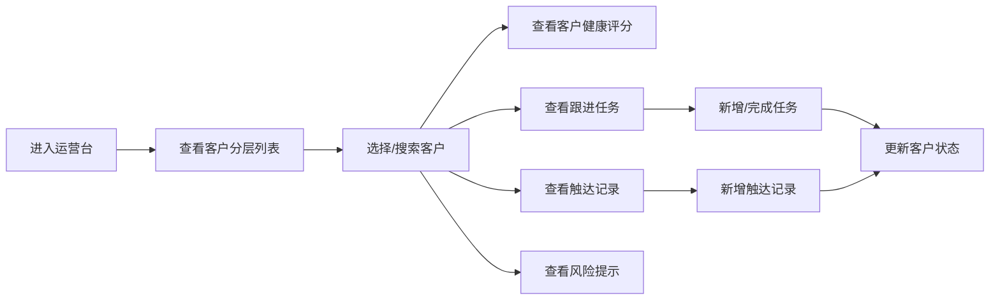

## 1. 产品概述

客户健康度运营台是客户成功团队的风险客户排查与管理工具，通过数据驱动的健康评分体系帮助团队主动识别风险客户，提升客户留存率与满意度。

- 核心目标：帮助客户成功经理快速定位高风险客户，统一管理跟进任务与触达记录
- 目标用户：客户成功团队、客户经理、运营人员
- 市场价值：降低客户流失率，提升客户生命周期价值

## 2. 核心功能

### 2.1 用户角色

| 角色 | 注册方式 | 核心权限 |
|------|----------|----------|
| 客户成功经理 | 企业账号登录 | 查看客户列表、管理跟进任务、记录触达信息 |
| 团队管理员 | 企业账号登录 | 管理风险规则、查看团队数据统计 |

### 2.2 功能模块

1. **客户分层列表**：按健康度分层展示客户，支持筛选与搜索
2. **客户健康评分**：多维度评分雷达图、评分趋势、评分构成详情
3. **跟进任务管理**：任务列表、任务状态切换、新增任务
4. **触达记录**：历史触达记录时间线、新增触达记录
5. **风险规则提示**：实时风险预警、规则详情展示

### 2.3 页面详情

| 页面名称 | 模块名称 | 功能描述 |
|----------|----------|----------|
| 运营台首页 | 客户分层列表 | 按健康度分层（高危/中危/健康）展示客户，支持搜索筛选 |
| 运营台首页 | 客户健康评分面板 | 雷达图展示多维度评分，总分展示，评分趋势曲线 |
| 运营台首页 | 跟进任务面板 | 展示当前客户待办任务，支持标记完成/新增任务 |
| 运营台首页 | 触达记录面板 | 时间线展示历史触达记录，支持新增记录 |
| 运营台首页 | 风险规则提示 | 高亮展示当前客户触发的风险规则 |

## 3. 核心流程

用户登录系统后，在客户列表中选择目标客户，系统联动展示该客户的健康评分、跟进任务、触达记录和风险提示。用户可新增跟进任务、记录客户触达，系统实时更新客户健康状态。

## 4. 用户界面设计

### 4.1 设计风格

- **主色调**：深蓝渐变（#1e3a5f 到 #2d5a87），体现专业与信任感
- **辅助色**：预警红（#e74c3c）、关注黄（#f39c12）、健康绿（#27ae60）
- **按钮风格**：圆角8px，悬浮有微妙阴影与色阶变化
- **字体**：标题使用思源黑体粗体，正文使用思源黑体常规，数字使用等宽字体
- **布局风格**：左侧客户列表 + 右侧多面板信息区的卡片式布局
- **图标风格**：线性图标，统一24px尺寸，与色彩体系呼应

### 4.2 页面设计概述

| 页面名称 | 模块名称 | UI元素 |
|----------|----------|--------|
| 运营台首页 | 客户分层列表 | 分层标签页、客户卡片、搜索框、状态徽章 |
| 运营台首页 | 健康评分面板 | 大数字评分、雷达图、趋势曲线、评分构成条 |
| 运营台首页 | 跟进任务面板 | 任务卡片、复选框、新增按钮、时间标签 |
| 运营台首页 | 触达记录面板 | 时间线、记录卡片、触达方式标签、新增表单 |
| 运营台首页 | 风险规则提示 | 警示卡片、规则图标、详情展开、处理建议 |

### 4.3 响应性

- Desktop-first 设计，主适配1440px宽度
- 平板端自适应调整面板布局为上下堆叠
- 移动端采用单列布局，优化触控区域

### 4.4 空状态设计

- **无客户数据**：显示插图 + "暂无客户数据" + 引导操作
- **规则缺失**：显示警告图标 + "风险规则未配置" + 配置指引
- **触达为空**：显示空状态图标 + "暂无触达记录" + 记录按钮
- **任务为空**：显示清单图标 + "暂无跟进任务" + 创建按钮
