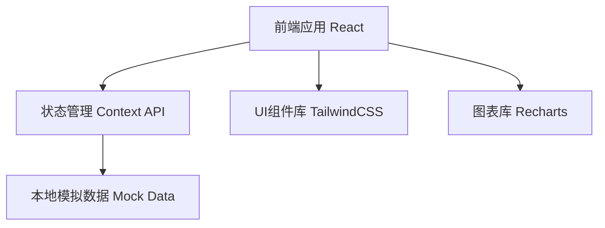

## 1. 架构设计



## 2. 技术描述

- **前端框架**: React@18 + TypeScript
- **构建工具**: Vite@5
- **样式方案**: TailwindCSS@3
- **状态管理**: React Context API + useReducer
- **图表可视化**: Recharts
- **图标库**: Lucide React
- **数据来源**: 本地Mock数据（JSON格式）

## 3. 目录结构

```
src/
├── components/          # 组件目录
│   ├── CustomerList/    # 客户列表组件
│   ├── HealthScore/     # 健康评分组件
│   ├── Tasks/           # 跟进任务组件
│   ├── ReachRecords/    # 触达记录组件
│   └── RiskAlerts/      # 风险提示组件
├── context/             # 状态管理
│   └── CustomerContext.tsx
├── data/                # 模拟数据
│   └── mockData.ts
├── types/               # 类型定义
│   └── index.ts
├── App.tsx              # 主应用
└── main.tsx             # 入口文件
```

## 4. 数据模型

### 4.1 TypeScript 类型定义

```typescript
interface Customer {
  id: string;
  name: string;
  company: string;
  avatar: string;
  healthScore: number;
  healthLevel: 'high-risk' | 'medium-risk' | 'healthy';
  lastContact: string;
  contractValue: number;
  renewalDate: string;
}

interface HealthDimension {
  name: string;
  score: number;
  weight: number;
}

interface Task {
  id: string;
  customerId: string;
  title: string;
  description: string;
  status: 'pending' | 'in-progress' | 'completed';
  dueDate: string;
  priority: 'high' | 'medium' | 'low';
  createdAt: string;
}

interface ReachRecord {
  id: string;
  customerId: string;
  type: 'call' | 'email' | 'meeting' | 'wechat';
  content: string;
  operator: string;
  createdAt: string;
  nextStep?: string;
}

interface RiskRule {
  id: string;
  name: string;
  description: string;
  severity: 'critical' | 'warning' | 'info';
  triggered: boolean;
  suggestion: string;
}
```

### 4.2 核心数据流

1. 应用初始化时加载本地Mock数据
2. CustomerContext 统一管理选中客户状态
3. 切换客户时触发各子组件数据联动更新
4. 用户操作（新增任务/触达记录）更新Context状态

## 5. 组件交互设计

| 组件 | 输入Props | 输出事件 |
|------|-----------|----------|
| CustomerList | customers[], selectedId | onSelectCustomer |
| HealthScorePanel | customerId, dimensions, scoreTrend | - |
| TaskPanel | customerId, tasks[] | onAddTask, onUpdateTask |
| ReachRecordPanel | customerId, records[] | onAddRecord |
| RiskAlertPanel | customerId, rules[] | - |

## 6. 空状态处理策略

- **无客户数据**: 检测 customers.length === 0，展示空状态组件
- **规则缺失**: 检测 rules.length === 0，展示配置引导
- **触达为空**: 检测 records.length === 0，展示新增引导
- **任务为空**: 检测 tasks.length === 0，展示创建引导
